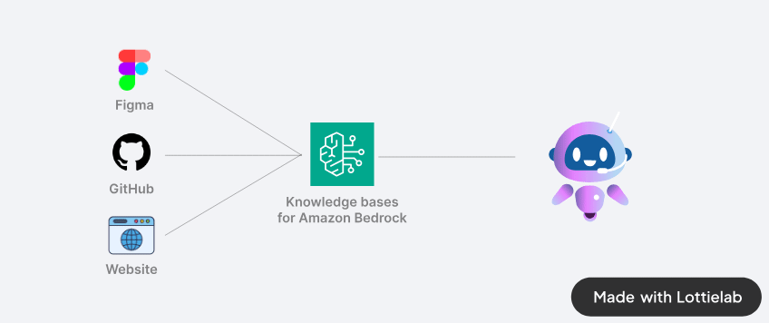

Language: [English](./README.md) / [Japanese](./README-ja.md)

# 🧙 Bedrock Enginner

Bedrock Enginner は、[Amazon Bedrock](https://aws.amazon.com/bedrock/) を活用したソフトウェア開発タスクのための AI アシスタントです。大規模な言語モデルと実際のファイルシステム操作、Web検索機能などを含む自律的な AI エージェントがあなたの開発を支援します。

## 💻 デモ

https://github.com/user-attachments/assets/83f46abe-0b69-4748-a4a0-e0155c7d80ae

## 🍎 はじめに

現在開発中であり、パッケージ化されたバイナリは作成されていません。ローカルでビルドして使用してください。

### ビルド

まず、npmモジュールをインストールします。

```
npm install
```

次に、アプリケーションパッケージをビルドします。

```
npm run build:mac
```

または

```
npm run build:win
```

または

```
npm run build:linux
```

`dist`ディレクトリに保存されたアプリケーションを使用します。

## ✨ 機能

### エージェントチャット

- 💬 人間のような Amazon Nova, Claude 3.5 モデルとの対話型チャットインターフェース。
- 📁 ファイルシステム操作（フォルダ作成、ファイル作成、ファイル読み/書き）
- 🔍 Tavily APIを使用したWeb検索機能
- 🏗️ プロジェクト構造の作成と管理
- 🧐 コード分析と改善提案
- 🚀 自動モードによる自動タスク完了
- 🔄 自動モードでの反復トラッキング

https://github.com/user-attachments/assets/838fc854-f310-40dc-8237-f82ffd623ef3

### ウェブサイトジェネレーター

以下のソースコードを生成し、リアルタイムにプレビューします。

- React.js（w/ Typescript）
- Vue.js（w/ Typescript）
- Svelte.js
- Vanilla.js

https://github.com/user-attachments/assets/d28c2ab1-70f4-4ce0-9537-cf89a2c31ad4

## デザインシステムのデータソースに接続する

Amazon Bedrockのナレッジベースに接続することで、任意のデザインシステム、プロジェクトソースコード、Webサイトのスタイルなどを参照してウェブサイトを生成できます。

事前にナレッジベースにソースコードとクロールしたWebページを保存する必要があります。ナレッジベースにソースコードを登録する際は、[gpt-repositoy-loader](https://github.com/mpoon/gpt-repository-loader) などの方法を使用してLLMが簡単に理解できる形式に変換することをお勧めします。



画面下部の「Connect」ボタンをクリックし、ナレッジベースIDを入力してください。

https://github.com/user-attachments/assets/23181de3-0ae1-43f3-8fe3-149f1f0108be

以下のスタイルもプリセットとしてサポートされています。

- インラインスタイリング
- Tailwind.css
- Material UI（Reactモードのみ）

### Step Functions ジェネレーター

AWS Step Functions の ASL 定義を生成し、リアルタイムにプレビューします。

https://github.com/user-attachments/assets/17756811-6314-438f-a13d-61af10c1963e

## Star History

[](https://star-history.com/#daisuke-awaji/bedrock-engineer&Date)

## ライセンス

MIT License

このソフトウェアは[Lottie Files](https://lottiefiles.com/free-animation/robot-futuristic-ai-animated-xyiArJ2DEF)を使用しています。
