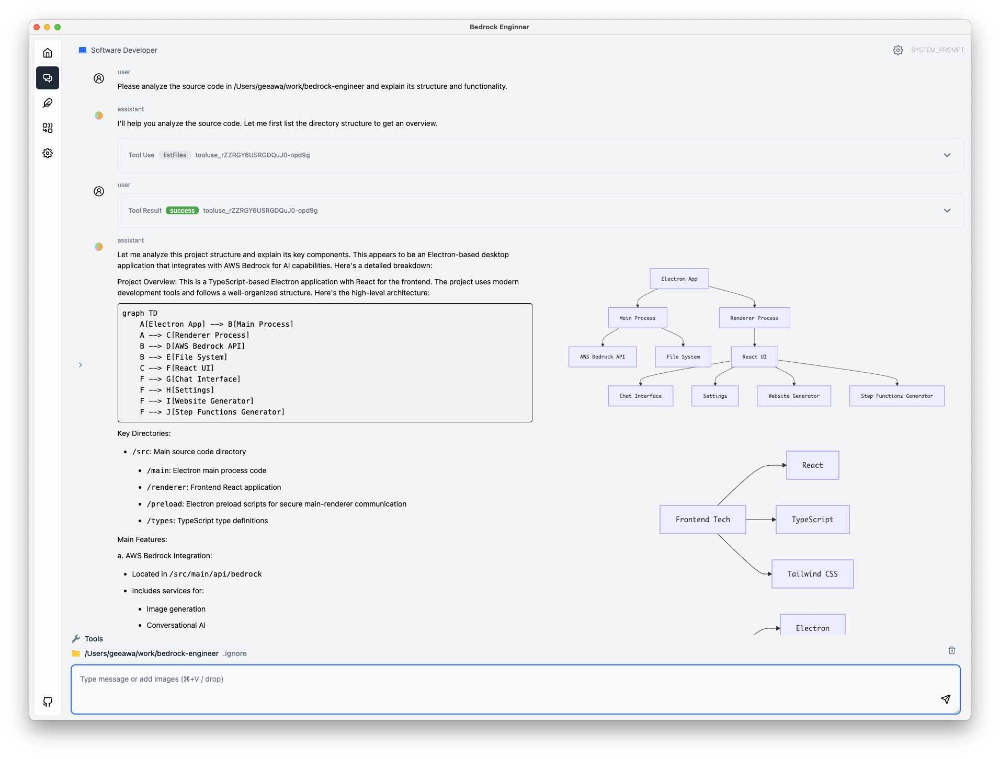
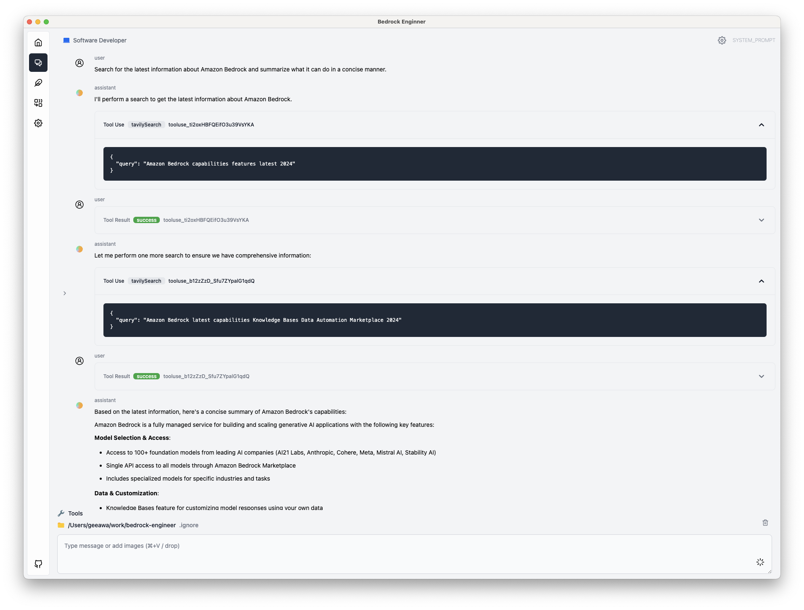
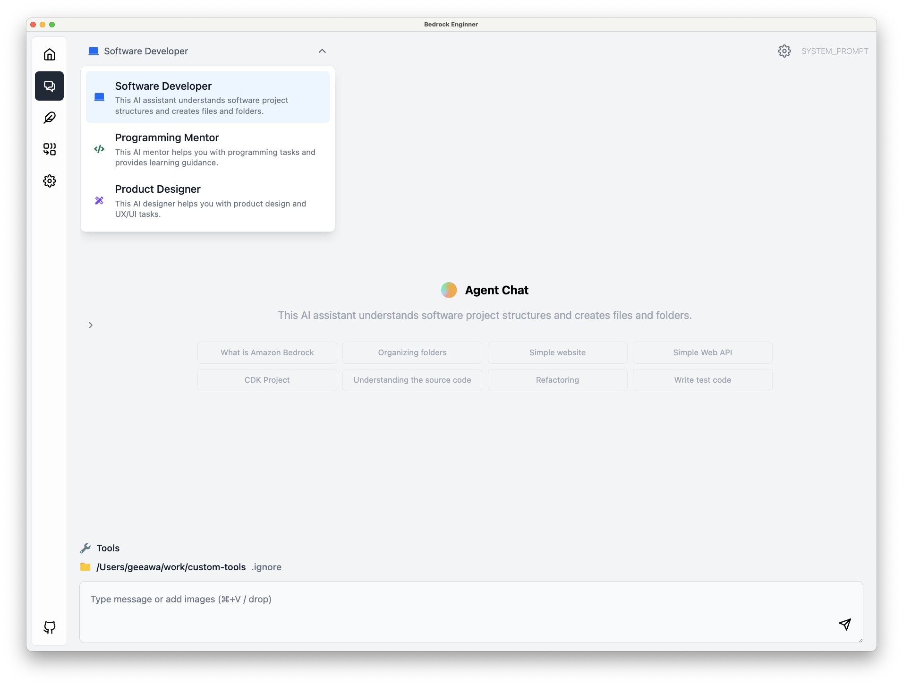
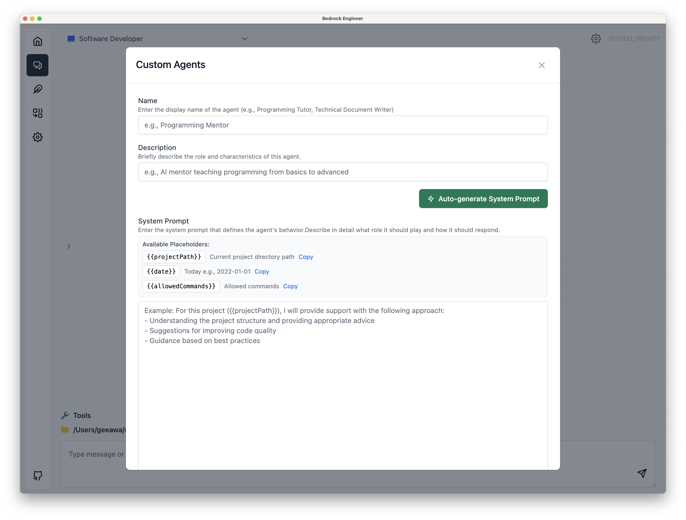
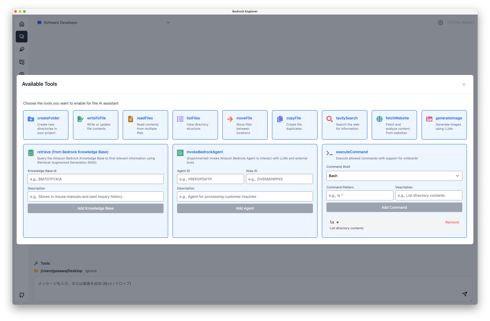
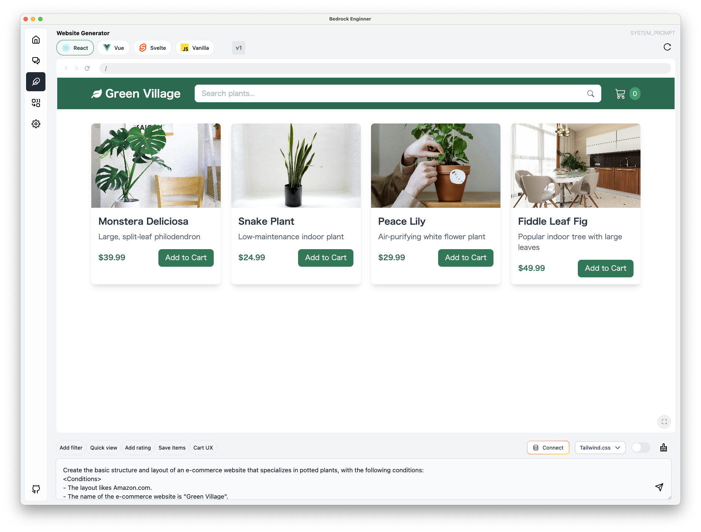
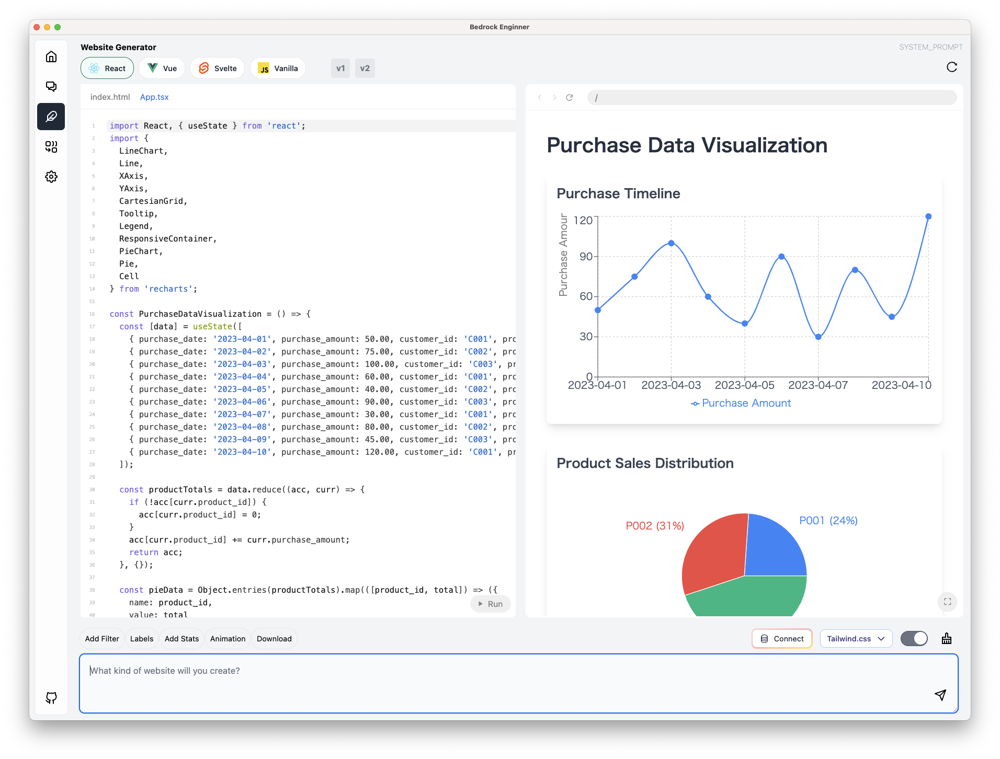
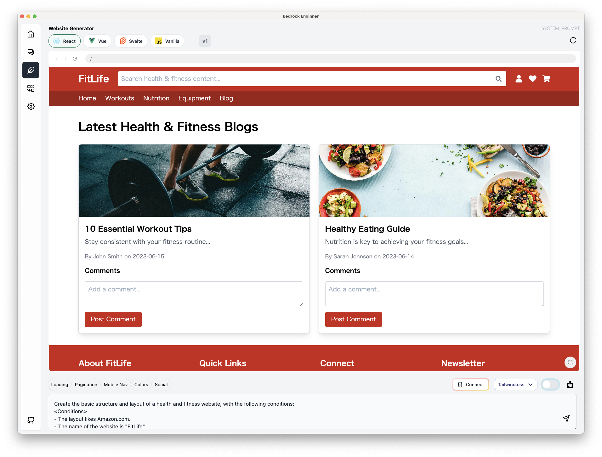

Language: [English](./README.md) / [Japanese](./README-ja.md)

# 🧙 Bedrock Engineer

Bedrock Engineer is an AI assistant for software development tasks powered by [Amazon Bedrock](https://aws.amazon.com/bedrock/). This autonomous AI agent combines the capabilities of large language models with practical file system operations and web search functionality to support your development process.

## 💻 Demo

https://github.com/user-attachments/assets/788583b6-148b-4e9d-9015-c24ad4be6162

## 🍎 Getting Started

It is still under development and no packaged binaries have been created. Please build it locally and use it.

### Build

First, install the npm modules:

```
npm install
```

Then, build application package

```
npm run build:mac
```

or

```
npm run build:win
```

or

```
npm run build:linux
```

Use the application stored in the `dist` directory.

## ✨ Features

### Agent Chat

The autonomous AI agent capable of development assists your development process. It provides functionality similar to AI assistants like [Cline](https://github.com/cline/cline), but with its own UI that doesn't depend on editors like VS Code. This enables richer diagramming and interactive experiences in Bedrock Engineer's agent chat feature. Additionally, with agent customization capabilities, you can utilize agents for use cases beyond development.

- 💬 Interactive chat interface with human-like Amazon Nova, Claude 3.5, and Meta llama models
- 📁 File system operations (create folders, files, read/write files)
- 🔍 Web search capabilities using Tavily API
- 🏗️ Project structure creation and management
- 🧐 Code analysis and improvement suggestions
- 📝 Code generation and execution
- 📊 Data analysis and visualization
- 💡 Agent customization and management
- 🛠️ Tool customization and management
- 🔄 Chat history management
- 🌐 Multi-language support

|  |  |
| :----------------------------------------------------: | :--------------------------------------------------: |
|             Code analysis and diagramming              |       Web search capabilities using Tavily API       |

## Select an Agent

Choose an agent from the menu in the top left. By default, it includes a Software Developer specialized in general software development, a Programming Mentor that assists with programming learning, and a Product Designer that supports the conceptual stage of services and products.



## Customize Agents

Click the ⚙️ icon in the top right to customize agent settings. Enter the agent's name, description, and system prompt. The system prompt is a crucial element that determines the agent's behavior. By clearly defining the agent's purpose, regulations, role, and when to use available tools, you can obtain more appropriate responses.



## Select Tools / Customize Tools

Click the Tools icon in the bottom left to select the tools available to the agent.



The supported tools are:

### 📂 File System Operations

| Tool Name      | Description                                                                                                                                                                   |
| -------------- | ----------------------------------------------------------------------------------------------------------------------------------------------------------------------------- |
| `createFolder` | Creates a new directory within the project structure. Creates a new folder at the specified path.                                                                             |
| `writeToFile`  | Writes content to a file. Creates a new file if it doesn't exist or updates content if the file exists.                                                                       |
| `readFiles`    | Reads contents from multiple files simultaneously. Supports text files and Excel files (.xlsx, .xls), automatically converting Excel files to CSV format.                     |
| `listFiles`    | Displays directory structure in a hierarchical format. Provides comprehensive project structure including all subdirectories and files, following configured ignore patterns. |
| `moveFile`     | Moves a file to a different location. Used for organizing files within the project structure.                                                                                 |
| `copyFile`     | Duplicates a file to a different location. Used when file duplication is needed within the project structure.                                                                 |

### 🌐 Web & Search Operations

| Tool Name      | Description                                                                                                                                                                                                                                                                                     |
| -------------- | ----------------------------------------------------------------------------------------------------------------------------------------------------------------------------------------------------------------------------------------------------------------------------------------------- |
| `tavilySearch` | Performs web searches using the Tavily API. Used when current information or additional context is needed. Requires an API key.                                                                                                                                                                 |
| `fetchWebsite` | Retrieves content from specified URLs. Large content is automatically split into manageable chunks. Initial call provides chunk overview, with specific chunks retrievable as needed. Supports GET, POST, PUT, DELETE, PATCH, HEAD, OPTIONS methods with custom headers and body configuration. |

### 🤖 Amazon Bedrock Integration

| Tool Name            | Description                                                                                                                                                                                                                                                                                                                                       |
| -------------------- | ------------------------------------------------------------------------------------------------------------------------------------------------------------------------------------------------------------------------------------------------------------------------------------------------------------------------------------------------- |
| `generateImage`      | Generates images using Amazon Bedrock LLMs. Uses stability.sd3-5-large-v1:0 by default and supports both Stability.ai and Amazon models. Supports specific aspect ratios and sizes for Titan models, with PNG, JPEG, and WebP output formats. Allows seed specification for deterministic generation and negative prompts for exclusion elements. |
| `retrieve`           | Searches information using Amazon Bedrock Knowledge Base. Retrieves relevant information from specified knowledge bases.                                                                                                                                                                                                                          |
| `invokeBedrockAgent` | Interacts with specified Amazon Bedrock Agents. Initiates dialogue using agent ID and alias ID, with session ID for conversation continuity. Provides file analysis capabilities for various use cases including Python code analysis and chat functionality.                                                                                     |

### 💻 System Command Execution

| Tool Name        | Description                                                                                                                                                                                                                                                                                                                                                                                                                                                                                                   |
| ---------------- | ------------------------------------------------------------------------------------------------------------------------------------------------------------------------------------------------------------------------------------------------------------------------------------------------------------------------------------------------------------------------------------------------------------------------------------------------------------------------------------------------------------- |
| `executeCommand` | Manages command execution and process input handling. Features two operational modes: 1) initiating new processes with command and working directory specification, 2) sending standard input to existing processes using process ID. For security reasons, only allowed commands can be executed, using the configured shell. Unregistered commands cannot be executed. The agent's capabilities can be extended by registering commands that connect to databases, execute APIs, or invoke other AI agents. |

### Website Generator

Generate and preview website source code in real-time. Currently supports the following libraries, and you can interactively generate code by providing additional instructions:

- React.js (w/ Typescript)
- Vue.js (w/ Typescript)
- Svelte.js
- Vanilla.js

Here are examples of screens generated by the Website Generator:

|  |  |  |
| :--------------------------------------------: | :--------------------------------------------------------------------: | :------------------------------------------------------------------: |
|          House Plant E-commerce Site           |                           Data Visualization                           |                           Healthcare Blog                            |

The following styles are also supported as presets:

- Inline styling
- Tailwind.css
- Material UI (React mode only)

#### Connect to Design System Data Source

By connecting to Amazon Bedrock's Knowledge Base, you can generate websites referencing any design system, project source code, or website styles.

You need to store source code and crawled web pages in the knowledge base in advance. When registering source code in the knowledge base, it is recommended to convert it into a format that LLM can easily understand using methods such as [gpt-repository-loader](https://github.com/mpoon/gpt-repository-loader). Figma design files can be referenced by registering HTML and CSS exported versions to the Knowledge Base.

Click the "Connect" button at the bottom of the screen and enter your knowledge base ID.

### Step Functions Generator

Generate AWS Step Functions ASL definitions and preview them in real-time.


## Star History

[](https://star-history.com/#daisuke-awaji/bedrock-engineer&Date)

## License

MIT License

This software uses [Lottie Files](https://lottiefiles.com/free-animation/robot-futuristic-ai-animated-xyiArJ2DEF).
