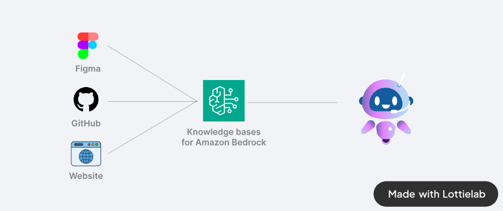

# 🧙 Bedrock Enginner

Bedrock Enginner is an AI assistant of software development tasks. This tool combines the capabilities of a large language model with practical file system operations, web search functionality.

## 💻 Demo

https://github.com/user-attachments/assets/83f46abe-0b69-4748-a4a0-e0155c7d80ae

## 🍎 Getting Started

It is still under development and no packaged binaries have been created. Please build it yourself and use it.

First, install the npm modules:

```
npm install
```

Then, build appplication package

```
npm run build:mac
```

or

```
npm run build:win
```

or

```
npm run build:linux
```

Use the application stored in the `dist` directory.

### AWS Credentials

Bedrock Engineer uses aws-sdk internally. Please set credentials using environment variables or shared credentials file as per the following document.

https://docs.aws.amazon.com/sdk-for-javascript/v2/developer-guide/loading-node-credentials-shared.html

## ✨ Features

### Agent Chat

- 💬 Interactive chat interface with Anthoropic Claude 3 models.
- 📁 File system operations (create folders, files, read/write files)
- 🔍 Web search capabilities using Tavily API
- 🏗️ Project structure creation and management
- 🧐 Code analysis and improvement suggestions
- 🚀 Automode for autonomous task completion
- 🔄 Iteration tracking in automode

https://github.com/user-attachments/assets/838fc854-f310-40dc-8237-f82ffd623ef3

### Website Generator

- React.js (w/ Typescript)
- Vue.js (w/ Typescript)
- Vanilla.js

https://github.com/user-attachments/assets/d28c2ab1-70f4-4ce0-9537-cf89a2c31ad4

## Connect datasource for your design system

By connecting to the Knowledge base for Amazon Bedrock, you can generate a website using any design system, project source code, website styles, etc. as reference.

You need to store source code and crawled web pages in the knowledge base in advance. When you register source code in the knowledge base, it is recommended that you convert it into a format that LLM can easily understand using a method such as gpt-repositoy-loader.



Click the "Connect" button at the bottom of the screen and enter your Knowledge base ID.

https://github.com/user-attachments/assets/23181de3-0ae1-43f3-8fe3-149f1f0108be

The following styles are also supported as presets:

- Inline styling
- Tailwind.css
- Material UI (React mode only)

### Step Function Generator

https://github.com/user-attachments/assets/17756811-6314-438f-a13d-61af10c1963e

## Star history

[](https://star-history.com/#daisuke-awaji/bedrock-engineer&Date)
